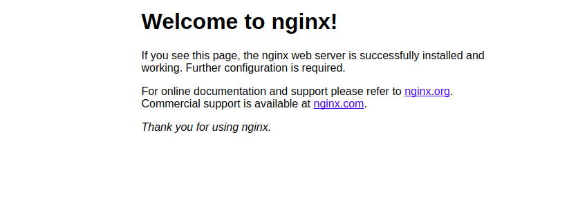

# terraform-kubernetes-automation

## clone the sample code
```bash
gsutil -m cp -r gs://spls/gsp233/* .
```
```bash
cd tf-gke-k8s-service-lb
```
## understand the code
```bash
cat main.tf
```
output :
```bash
...
variable "region" {
  default = "us-west1"
}
variable "location" {
  default = "us-west1-b"
}
variable "network_name" {
  default = "tf-gke-k8s"
}
provider "google" {
  region = var.region
}
resource "google_compute_network" "default" {
  name                    = var.network_name
  auto_create_subnetworks = false
}
resource "google_compute_subnetwork" "default" {
  name                     = var.network_name
  ip_cidr_range            = "10.127.0.0/20"
  network                  = google_compute_network.default.self_link
  region                   = var.region
  private_ip_google_access = true
}
...
```
- Variables are defined for region, zone, and network_name. These will be used to create the Kubernetes cluster
- The Google Cloud provider will let us create resources in this project
- There are several resources defined to create the appropriate network and cluster
- At the end, there are some outputs which you'll see after running terraform apply

Review the contents of the k8s.tf file:
```bash
cat k8s.tf
```
output : 
```bash
provider "kubernetes" {
  version = "~> 1.10.0"
  host    = google_container_cluster.default.endpoint
  token   = data.google_client_config.current.access_token
  client_certificate = base64decode(
    google_container_cluster.default.master_auth[0].client_certificate,
  )
  client_key = base64decode(google_container_cluster.default.master_auth[0].client_key)
  cluster_ca_certificate = base64decode(
    google_container_cluster.default.master_auth[0].cluster_ca_certificate,
  )
}
resource "kubernetes_namespace" "staging" {
  metadata {
    name = "staging"
  }
}
resource "google_compute_address" "default" {
  name   = var.network_name
  region = var.region
}
resource "kubernetes_service" "nginx" {
  metadata {
    namespace = kubernetes_namespace.staging.metadata[0].name
    name      = "nginx"
  }
  spec {
    selector = {
      run = "nginx"
    }
    session_affinity = "ClientIP"
    port {
      protocol    = "TCP"
      port        = 80
      target_port = 80
    }
    type             = "LoadBalancer"
    load_balancer_ip = google_compute_address.default.address
  }
}
resource "kubernetes_replication_controller" "nginx" {
  metadata {
    name      = "nginx"
    namespace = kubernetes_namespace.staging.metadata[0].name
    labels = {
      run = "nginx"
    }
  }
  spec {
    selector = {
      run = "nginx"
    }
    template {
      container {
        image = "nginx:latest"
        name  = "nginx"
        resources {
          limits {
            cpu    = "0.5"
            memory = "512Mi"
          }
          requests {
            cpu    = "250m"
            memory = "50Mi"
          }
        }
      }
    }
  }
}
output "load-balancer-ip" {
  value = google_compute_address.default.address
}
```
## Initialize and install dependencies
The terraform init command is used to initialize a working directory containing the Terraform configuration files.

This command performs several different initialization steps in order to prepare a working directory for use and is always safe to run multiple times, to bring the working directory up to date with changes in the configuration:

Run terraform init:
```bash
terraform init
```
example output :
```bash
...
* provider.google: version = "~> 3.8.0"
* provider.kubernetes: version = "~> 1.10.0"
Terraform has been successfully initialized!
You may now begin working with Terraform. Try running `terraform plan` to see
any changes that are required for your infrastructure. All Terraform commands
should now work.
If you ever set or change modules or backend configuration for Terraform,
rerun this command to reinitialize your working directory. If you forget, other
commands will detect it and remind you to do so if necessary.
```

Run the terraform apply command, which is used to apply the changes required to reach the desired state of the configuration.
```bash
terraform apply
```
Review Terraform's actions and inspect the resources which will be created.

When ready, type yes to begin Terraform actions.

On completion, you should see similar output:
```bash
Apply complete! Resources: 7 added, 0 changed, 0 destroyed.
Outputs:
cluster_name = tf-gke-k8s
cluster_region = us-west1
cluster_zone = us-west1-b
load-balancer-ip = 35.233.177.223
network = https://www.googleapis.com/compute/beta/projects/qwiklabs-gcp-5438ad3a5e852e4a/global/networks/tf-gke-k8s
subnetwork_name = tf-gke-k8s
```

## Verify resources created by Terraform
- In the console, navigate to Navigation menu > Kubernetes Engine.
- Click on tf-gke-k8s cluster and check its configuration.
- In the left panel, click Services & Ingress and check the nginx service status.
- Click the Endpoints IP address to open the Welcome to nginx! page in a new browser tab.



[>sumber belajar<](https://www.cloudskillsboost.google/focuses/1205?parent=catalog)
